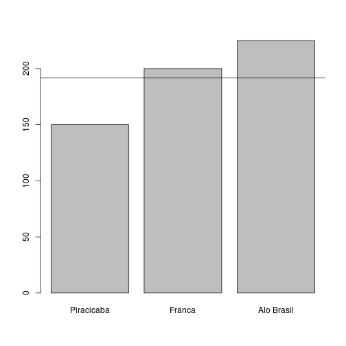
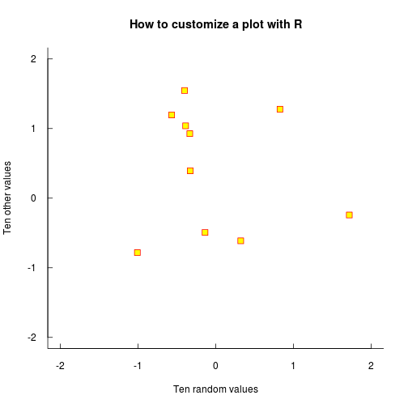
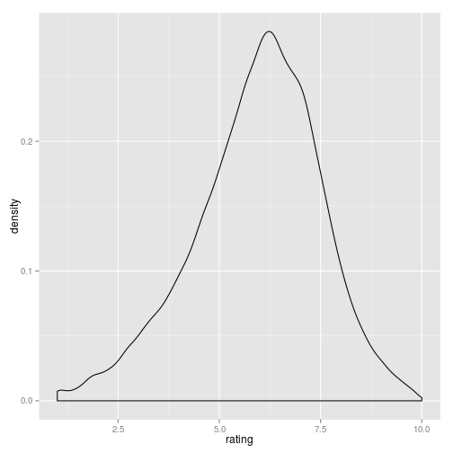
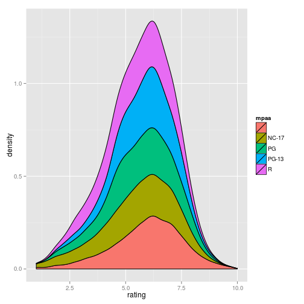
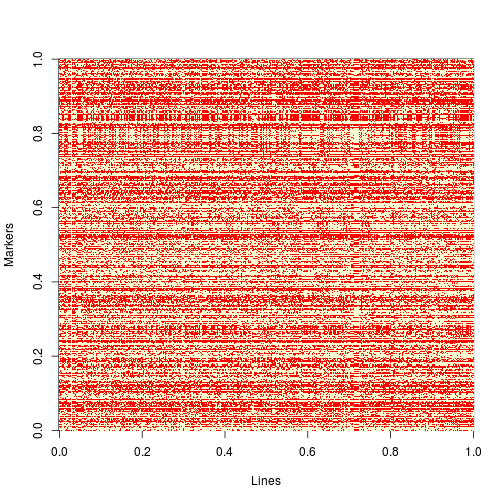
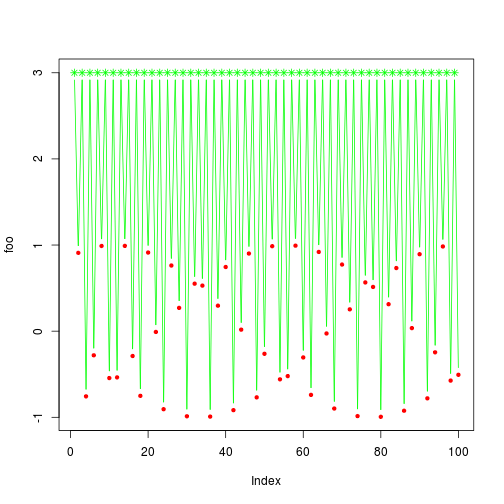
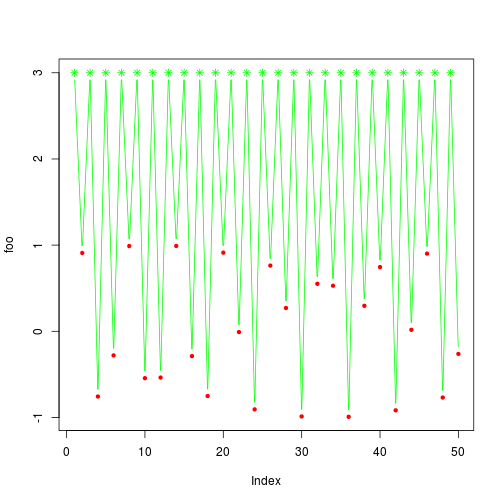

## Outline

1. Introduction
2. Basic Syntax
3. Object Types
4. Graphics
5. Programming

<!---
    Antonio Augusto F. Garcia

    http://about.me/augusto.garcia

    augusto.garcia@usp.br
-->

--- .class #id 

## R Learning Curve


---

## Few concepts can make a big difference

<iframe width="560" height="315" src="http://www.youtube.com/embed/5pidokakU4I" frameborder="0" allowfullscreen></iframe>

---

## R

 + Statistics
 + Modeling
 + Graphics
 + Programming language
 + Free
 + Open Source
 + Extensible
 + DATA
 + "Lingua franca" of Statistics (Bioinformatics?)
 
  [R Project:](http://www.r-project.org) http://www.r-project.org

  [RStudio:](http://www.rstudio.com) http://www.rstudio.com

---

## But there is more!

http://www.foastat.org/


---

## ... and more!

http://yihui.name/knitr/


---

## ... and even more!

These very slides were produced using an R package: [slidify](http://slidify.org/)

<iframe width="420" height="315" src="http://www.youtube.com/embed/I95GOmLc7TA" frameborder="0" allowfullscreen></iframe>

---

### Exercise

1. Install [R](http://www.r-project.org)
2. Install [RStudio](http://www.rstudio.com)
3. Take a look on the interface, trying to see where you are
4. Use R as a calculator:
   
   ```r
   10
   ```
   
   ```
   ## [1] 10
   ```
   
   ```r
   1 + 3
   ```
   
   ```
   ## [1] 4
   ```


---

   
   ```r
   4/3
   ```
   
   ```
   ## [1] 1.333
   ```
   
   ```r
   4%%3  # modulo operator
   ```
   
   ```
   ## [1] 1
   ```

---

## You can write reports on R

+ Syntax: straightforward

### Exercise

1. Download the file [knitr_example.Rmd](https://github.com/augusto-garcia/R-Introduction/blob/gh-pages/knitr_example.Rmd). It uses
       [R Markdown](http://www.rstudio.com/ide/docs/r_markdown)
       syntax.
2. Open it on RStudio
3. Take a look on it, finding headers, lists (numbered, or items), and
   R chunks
4. Try to add a few comments and R chunks
5. Compile it to produce an html report
6. (This is making usage of the amazing package [knitr](http://yihui.name/knitr/))
7. Use it for taking notes during this course

---

## For reproducibility:


```r
sessionInfo()
```

```
## R version 2.15.2 (2012-10-26)
## Platform: x86_64-pc-linux-gnu (64-bit)
## 
## locale:
##  [1] LC_CTYPE=pt_BR.UTF-8       LC_NUMERIC=C              
##  [3] LC_TIME=pt_BR.UTF-8        LC_COLLATE=pt_BR.UTF-8    
##  [5] LC_MONETARY=pt_BR.UTF-8    LC_MESSAGES=pt_BR.UTF-8   
##  [7] LC_PAPER=C                 LC_NAME=C                 
##  [9] LC_ADDRESS=C               LC_TELEPHONE=C            
## [11] LC_MEASUREMENT=pt_BR.UTF-8 LC_IDENTIFICATION=C       
## 
## attached base packages:
## [1] parallel  graphics  grDevices utils     datasets  stats     methods  
## [8] base     
## 
## other attached packages:
##  [1] sos_1.3-8          R2G2_1.0-2         qtl_1.30-4        
##  [4] plyr_1.8           fortunes_1.5-2     brew_1.0-6        
##  [7] BLR_1.3            SuppDists_1.1-9.1  slidify_0.4       
## [10] RColorBrewer_1.0-5 knitr_1.5          ggplot2_0.9.3.1   
## 
## loaded via a namespace (and not attached):
##  [1] codetools_0.2-8  colorspace_1.2-4 compiler_2.15.2  dichromat_2.0-0 
##  [5] digest_0.6.4     evaluate_0.5.1   formatR_0.10     grid_2.15.2     
##  [9] gtable_0.1.2     labeling_0.2     markdown_0.6.4   MASS_7.3-23     
## [13] munsell_0.4.2    proto_0.3-10     reshape2_1.2.2   scales_0.2.3    
## [17] stringr_0.6.2    tools_2.15.2     whisker_0.3-2    yaml_2.1.10
```


--- .segue .dark .quote

<q class = 'yellow'> Reproducible research is a very important
concept. Not only in order to allow others to reproduce and understand
what you did, but also to allow others to extend your research.
Programs with 'point and click' menus are not in line with this
concept.</q>

---

## R syntax


```r
10 > 2
```

```
## [1] TRUE
```

```r
(3 * 2) == 5  # caution: '==' is different than '='
```

```
## [1] FALSE
```


```r
"Hello, world"
```

```
## [1] "Hello, world"
```


---

## Variables


```r
a <- 100
a
```

```
## [1] 100
```

```r
a * 8
```

```
## [1] 800
```

```r
a <- 20
a <- "New string"
a
```

```
## [1] "New string"
```


---

## Functions


```r
log(100)
```

```
## [1] 4.605
```

```r
log10(100)
```

```
## [1] 2
```

```r
sequence(5)
```

```
## [1] 1 2 3 4 5
```

```r
seq(from = 0, to = 1, by = 0.2)
```

```
## [1] 0.0 0.2 0.4 0.6 0.8 1.0
```


---

### Exercise

1. Compute the square root of all numbers from 7 to 1458.
2. Compute the square root of all even numbers from 7 to 1458.


---

## Help!


```r
help(seq)
`?`(seq)
help.search("histogram")
```


### Exercise

1. Find help about the function plot()

---

## RSeek

http://www.rseek.org/


---

### Exercise

1. Find R packages for "linkage mapping"
2. Find R packages for "QTL mapping"
3. "Genomic selection"
4. ... (your choice)

---

## Install and load packages

+ Repositories: your choice, but closer is better


```r
install.packages()
```


```r
install.packages("fortunes")
```


```r
library("fortunes")
fortune()
```

```
## 
## I cannot remember if I have been using 14 or 14, I think it was 14 and I
## am not near the machine to check.
##    -- John Kane (confused about his SPSS version)
##       R-help (April 2007)
```


---

## More help


```r
install.packages("sos")
```


```r
library("sos")
findFn("qtl")
```

```
## found 633 matches;  retrieving 20 pages, 400 matches.
## 2 3 4 5 6 7 8 9 10 
## 11 12 13 14 15 16 17 18 19 20 
## 
## Downloaded 354 links in 33 packages.
```


---

## SOS!
  

```r
findFn("metabolomic")
```

```
## found 65 matches;  retrieving 4 pages
## 2 3 4 
## Downloaded 63 links in 16 packages.
```

```r
findFn("qtl mapping metabolomic")
```

```
## found 2 matches
## Downloaded 2 links in 1 packages.
```


---

## Packages on your computer


```r
installed.packages()
```

```
##                  Package           
## bitops           "bitops"          
## BLR              "BLR"             
## colorspace       "colorspace"      
## devtools         "devtools"        
## dichromat        "dichromat"       
## digest           "digest"          
## evaluate         "evaluate"        
## formatR          "formatR"         
## fortunes         "fortunes"        
## ggplot2          "ggplot2"         
## gtable           "gtable"          
## highr            "highr"           
## httr             "httr"            
## knitr            "knitr"           
## labeling         "labeling"        
## markdown         "markdown"        
## memoise          "memoise"         
## munsell          "munsell"         
## plyr             "plyr"            
## proto            "proto"           
## qtl              "qtl"             
## R2G2             "R2G2"            
## RColorBrewer     "RColorBrewer"    
## RCurl            "RCurl"           
## reshape2         "reshape2"        
## scales           "scales"          
## slidify          "slidify"         
## slidifyLibraries "slidifyLibraries"
## stringr          "stringr"         
## SuppDists        "SuppDists"       
## whisker          "whisker"         
## yaml             "yaml"            
## base             "base"            
## boot             "boot"            
## class            "class"           
## cluster          "cluster"         
## codetools        "codetools"       
## compiler         "compiler"        
## datasets         "datasets"        
## foreign          "foreign"         
## graphics         "graphics"        
## grDevices        "grDevices"       
## grid             "grid"            
## KernSmooth       "KernSmooth"      
## lattice          "lattice"         
## MASS             "MASS"            
## Matrix           "Matrix"          
## methods          "methods"         
## mgcv             "mgcv"            
## nlme             "nlme"            
## nnet             "nnet"            
## parallel         "parallel"        
## rpart            "rpart"           
## spatial          "spatial"         
## splines          "splines"         
## stats            "stats"           
## stats4           "stats4"          
## survival         "survival"        
## tcltk            "tcltk"           
## tools            "tools"           
## utils            "utils"           
##                  LibPath                                           
## bitops           "/home/augusto/R/x86_64-pc-linux-gnu-library/2.15"
## BLR              "/home/augusto/R/x86_64-pc-linux-gnu-library/2.15"
## colorspace       "/home/augusto/R/x86_64-pc-linux-gnu-library/2.15"
## devtools         "/home/augusto/R/x86_64-pc-linux-gnu-library/2.15"
## dichromat        "/home/augusto/R/x86_64-pc-linux-gnu-library/2.15"
## digest           "/home/augusto/R/x86_64-pc-linux-gnu-library/2.15"
## evaluate         "/home/augusto/R/x86_64-pc-linux-gnu-library/2.15"
## formatR          "/home/augusto/R/x86_64-pc-linux-gnu-library/2.15"
## fortunes         "/home/augusto/R/x86_64-pc-linux-gnu-library/2.15"
## ggplot2          "/home/augusto/R/x86_64-pc-linux-gnu-library/2.15"
## gtable           "/home/augusto/R/x86_64-pc-linux-gnu-library/2.15"
## highr            "/home/augusto/R/x86_64-pc-linux-gnu-library/2.15"
## httr             "/home/augusto/R/x86_64-pc-linux-gnu-library/2.15"
## knitr            "/home/augusto/R/x86_64-pc-linux-gnu-library/2.15"
## labeling         "/home/augusto/R/x86_64-pc-linux-gnu-library/2.15"
## markdown         "/home/augusto/R/x86_64-pc-linux-gnu-library/2.15"
## memoise          "/home/augusto/R/x86_64-pc-linux-gnu-library/2.15"
## munsell          "/home/augusto/R/x86_64-pc-linux-gnu-library/2.15"
## plyr             "/home/augusto/R/x86_64-pc-linux-gnu-library/2.15"
## proto            "/home/augusto/R/x86_64-pc-linux-gnu-library/2.15"
## qtl              "/home/augusto/R/x86_64-pc-linux-gnu-library/2.15"
## R2G2             "/home/augusto/R/x86_64-pc-linux-gnu-library/2.15"
## RColorBrewer     "/home/augusto/R/x86_64-pc-linux-gnu-library/2.15"
## RCurl            "/home/augusto/R/x86_64-pc-linux-gnu-library/2.15"
## reshape2         "/home/augusto/R/x86_64-pc-linux-gnu-library/2.15"
## scales           "/home/augusto/R/x86_64-pc-linux-gnu-library/2.15"
## slidify          "/home/augusto/R/x86_64-pc-linux-gnu-library/2.15"
## slidifyLibraries "/home/augusto/R/x86_64-pc-linux-gnu-library/2.15"
## stringr          "/home/augusto/R/x86_64-pc-linux-gnu-library/2.15"
## SuppDists        "/home/augusto/R/x86_64-pc-linux-gnu-library/2.15"
## whisker          "/home/augusto/R/x86_64-pc-linux-gnu-library/2.15"
## yaml             "/home/augusto/R/x86_64-pc-linux-gnu-library/2.15"
## base             "/usr/lib/R/library"                              
## boot             "/usr/lib/R/library"                              
## class            "/usr/lib/R/library"                              
## cluster          "/usr/lib/R/library"                              
## codetools        "/usr/lib/R/library"                              
## compiler         "/usr/lib/R/library"                              
## datasets         "/usr/lib/R/library"                              
## foreign          "/usr/lib/R/library"                              
## graphics         "/usr/lib/R/library"                              
## grDevices        "/usr/lib/R/library"                              
## grid             "/usr/lib/R/library"                              
## KernSmooth       "/usr/lib/R/library"                              
## lattice          "/usr/lib/R/library"                              
## MASS             "/usr/lib/R/library"                              
## Matrix           "/usr/lib/R/library"                              
## methods          "/usr/lib/R/library"                              
## mgcv             "/usr/lib/R/library"                              
## nlme             "/usr/lib/R/library"                              
## nnet             "/usr/lib/R/library"                              
## parallel         "/usr/lib/R/library"                              
## rpart            "/usr/lib/R/library"                              
## spatial          "/usr/lib/R/library"                              
## splines          "/usr/lib/R/library"                              
## stats            "/usr/lib/R/library"                              
## stats4           "/usr/lib/R/library"                              
## survival         "/usr/lib/R/library"                              
## tcltk            "/usr/lib/R/library"                              
## tools            "/usr/lib/R/library"                              
## utils            "/usr/lib/R/library"                              
##                  Version    Priority     
## bitops           "1.0-6"    NA           
## BLR              "1.3"      NA           
## colorspace       "1.2-4"    NA           
## devtools         "1.4.1"    NA           
## dichromat        "2.0-0"    NA           
## digest           "0.6.4"    NA           
## evaluate         "0.5.1"    NA           
## formatR          "0.10"     NA           
## fortunes         "1.5-2"    NA           
## ggplot2          "0.9.3.1"  NA           
## gtable           "0.1.2"    NA           
## highr            "0.3"      NA           
## httr             "0.2"      NA           
## knitr            "1.5"      NA           
## labeling         "0.2"      NA           
## markdown         "0.6.4"    NA           
## memoise          "0.1"      NA           
## munsell          "0.4.2"    NA           
## plyr             "1.8"      NA           
## proto            "0.3-10"   NA           
## qtl              "1.30-4"   NA           
## R2G2             "1.0-2"    NA           
## RColorBrewer     "1.0-5"    NA           
## RCurl            "1.95-4.1" NA           
## reshape2         "1.2.2"    NA           
## scales           "0.2.3"    NA           
## slidify          "0.4"      NA           
## slidifyLibraries "0.3.1"    NA           
## stringr          "0.6.2"    NA           
## SuppDists        "1.1-9.1"  NA           
## whisker          "0.3-2"    NA           
## yaml             "2.1.10"   NA           
## base             "2.15.2"   "base"       
## boot             "1.3-7"    "recommended"
## class            "7.3-5"    "recommended"
## cluster          "1.14.3"   "recommended"
## codetools        "0.2-8"    "recommended"
## compiler         "2.15.2"   "base"       
## datasets         "2.15.2"   "base"       
## foreign          "0.8-52"   "recommended"
## graphics         "2.15.2"   "base"       
## grDevices        "2.15.2"   "base"       
## grid             "2.15.2"   "base"       
## KernSmooth       "2.23-8"   "recommended"
## lattice          "0.20-13"  "recommended"
## MASS             "7.3-23"   "recommended"
## Matrix           "1.0-11"   "recommended"
## methods          "2.15.2"   "base"       
## mgcv             "1.7-22"   "recommended"
## nlme             "3.1-108"  "recommended"
## nnet             "7.3-5"    "recommended"
## parallel         "2.15.2"   "base"       
## rpart            "4.1-0"    "recommended"
## spatial          "7.3-5"    "recommended"
## splines          "2.15.2"   "base"       
## stats            "2.15.2"   "base"       
## stats4           "2.15.2"   "base"       
## survival         "2.37-2"   "recommended"
## tcltk            "2.15.2"   "base"       
## tools            "2.15.2"   "base"       
## utils            "2.15.2"   "base"       
##                  Depends                                           
## bitops           NA                                                
## BLR              "R (>= 2.10), SuppDists"                          
## colorspace       "R (>= 2.13.0), methods"                          
## devtools         "R (>= 2.15)"                                     
## dichromat        "R (>= 2.10), stats"                              
## digest           "R (>= 2.4.1)"                                    
## evaluate         "R (>= 2.14.0)"                                   
## formatR          NA                                                
## fortunes         NA                                                
## ggplot2          "R (>= 2.14), stats, methods"                     
## gtable           "R (>= 2.14), grid"                               
## highr            NA                                                
## httr             NA                                                
## knitr            "R (>= 2.14.1)"                                   
## labeling         NA                                                
## markdown         "R (>= 2.11.1)"                                   
## memoise          NA                                                
## munsell          NA                                                
## plyr             "R (>= 2.11.0)"                                   
## proto            NA                                                
## qtl              "R (>= 2.14.0), graphics, stats, parallel, utils" 
## R2G2             NA                                                
## RColorBrewer     "R (>= 2.0.0)"                                    
## RCurl            "R (>= 2.7.0), methods, bitops"                   
## reshape2         NA                                                
## scales           "R (>= 2.12), methods"                            
## slidify          "\nR (>= 2.15.0)"                                 
## slidifyLibraries NA                                                
## stringr          "R (>= 2.14)"                                     
## SuppDists        NA                                                
## whisker          NA                                                
## yaml             NA                                                
## base             NA                                                
## boot             "R (>= 2.14.0), graphics, stats"                  
## class            "R (>= 2.5.0), stats, utils"                      
## cluster          "R (>= 2.10.0), stats, graphics, utils"           
## codetools        "R (>= 2.1)"                                      
## compiler         NA                                                
## datasets         NA                                                
## foreign          "R (>= 2.14.0), stats"                            
## graphics         NA                                                
## grDevices        NA                                                
## grid             NA                                                
## KernSmooth       "R (>= 2.5.0), stats"                             
## lattice          "R (>= 2.15.1)"                                   
## MASS             "R (>= 2.14.0), grDevices, graphics, stats, utils"
## Matrix           "R (>= 2.15.0), stats, methods, utils, lattice"   
## methods          NA                                                
## mgcv             "R (>= 2.14.0), stats, graphics"                  
## nlme             "graphics, stats, R (>= 2.14.0), R (< 3.0.0)"     
## nnet             "R (>= 2.5.0), stats, utils"                      
## parallel         NA                                                
## rpart            "R (>= 2.14.0), graphics, stats, grDevices"       
## spatial          "R (>= 2.5.0), graphics, stats, utils"            
## splines          NA                                                
## stats            NA                                                
## stats4           "methods, graphics, stats"                        
## survival         "stats, utils, graphics, splines, R (>= 2.13.0)"  
## tcltk            NA                                                
## tools            NA                                                
## utils            NA                                                
##                  Imports                                                                                                       
## bitops           NA                                                                                                            
## BLR              NA                                                                                                            
## colorspace       NA                                                                                                            
## devtools         "httr, RCurl, utils, tools, methods, memoise, whisker,\nevaluate, digest"                                     
## dichromat        NA                                                                                                            
## digest           NA                                                                                                            
## evaluate         "stringr (>= 0.4)"                                                                                            
## formatR          NA                                                                                                            
## fortunes         "utils"                                                                                                       
## ggplot2          "plyr (>= 1.7.1), digest, grid, gtable (>= 0.1.1), reshape2,\nscales (>= 0.2.3), proto, MASS"                 
## gtable           NA                                                                                                            
## highr            NA                                                                                                            
## httr             "RCurl (>= 1.95-0), stringr (>= 0.6.1), digest, tools"                                                        
## knitr            "evaluate (>= 0.4.7), digest, formatR (>= 0.9), highr (>= 0.2),\nmarkdown (>= 0.6.3), stringr (>= 0.6), tools"
## labeling         NA                                                                                                            
## markdown         NA                                                                                                            
## memoise          "digest"                                                                                                      
## munsell          "colorspace"                                                                                                  
## plyr             NA                                                                                                            
## proto            NA                                                                                                            
## qtl              NA                                                                                                            
## R2G2             NA                                                                                                            
## RColorBrewer     NA                                                                                                            
## RCurl            "methods"                                                                                                     
## reshape2         "plyr (>= 1.5), stringr, lattice"                                                                             
## scales           "RColorBrewer, stringr, dichromat, munsell (>= 0.2), plyr (>=\n1.2), labeling"                                
## slidify          "\nknitr (>= 0.1),\nmarkdown,\nstringr,\nyaml,\nwhisker"                                                      
## slidifyLibraries NA                                                                                                            
## stringr          NA                                                                                                            
## SuppDists        NA                                                                                                            
## whisker          NA                                                                                                            
## yaml             NA                                                                                                            
## base             NA                                                                                                            
## boot             NA                                                                                                            
## class            "MASS"                                                                                                        
## cluster          NA                                                                                                            
## codetools        NA                                                                                                            
## compiler         NA                                                                                                            
## datasets         NA                                                                                                            
## foreign          "methods, utils"                                                                                              
## graphics         "grDevices"                                                                                                   
## grDevices        NA                                                                                                            
## grid             "grDevices"                                                                                                   
## KernSmooth       NA                                                                                                            
## lattice          "grid, grDevices, graphics, stats, utils"                                                                     
## MASS             NA                                                                                                            
## Matrix           "graphics, grid"                                                                                              
## methods          "utils"                                                                                                       
## mgcv             "nlme, methods, Matrix"                                                                                       
## nlme             "lattice"                                                                                                     
## nnet             NA                                                                                                            
## parallel         NA                                                                                                            
## rpart            NA                                                                                                            
## spatial          NA                                                                                                            
## splines          "graphics, stats"                                                                                             
## stats            NA                                                                                                            
## stats4           NA                                                                                                            
## survival         NA                                                                                                            
## tcltk            NA                                                                                                            
## tools            NA                                                                                                            
## utils            NA                                                                                                            
##                  LinkingTo
## bitops           NA       
## BLR              NA       
## colorspace       NA       
## devtools         NA       
## dichromat        NA       
## digest           NA       
## evaluate         NA       
## formatR          NA       
## fortunes         NA       
## ggplot2          NA       
## gtable           NA       
## highr            NA       
## httr             NA       
## knitr            NA       
## labeling         NA       
## markdown         NA       
## memoise          NA       
## munsell          NA       
## plyr             NA       
## proto            NA       
## qtl              NA       
## R2G2             NA       
## RColorBrewer     NA       
## RCurl            NA       
## reshape2         NA       
## scales           NA       
## slidify          NA       
## slidifyLibraries NA       
## stringr          NA       
## SuppDists        NA       
## whisker          NA       
## yaml             NA       
## base             NA       
## boot             NA       
## class            NA       
## cluster          NA       
## codetools        NA       
## compiler         NA       
## datasets         NA       
## foreign          NA       
## graphics         NA       
## grDevices        NA       
## grid             NA       
## KernSmooth       NA       
## lattice          NA       
## MASS             NA       
## Matrix           NA       
## methods          NA       
## mgcv             NA       
## nlme             NA       
## nnet             NA       
## parallel         NA       
## rpart            NA       
## spatial          NA       
## splines          NA       
## stats            NA       
## stats4           NA       
## survival         NA       
## tcltk            NA       
## tools            NA       
## utils            NA       
##                  Suggests                                                                             
## bitops           NA                                                                                   
## BLR              NA                                                                                   
## colorspace       "KernSmooth, MASS, kernlab, mvtnorm, vcd, tcltk, dichromat"                          
## devtools         "testthat (>= 0.7), roxygen2, BiocInstaller, Rcpp (>= 0.10.0),\nMASS, knitr, rstudio"
## dichromat        NA                                                                                   
## digest           NA                                                                                   
## evaluate         "testthat, ggplot2"                                                                  
## formatR          "codetools, gWidgetsRGtk2, testit, knitr"                                            
## fortunes         NA                                                                                   
## ggplot2          "quantreg, Hmisc, mapproj, maps, hexbin, maptools, multcomp,\nnlme, testthat"        
## gtable           "testthat, plyr"                                                                     
## highr            "knitr, testit"                                                                      
## httr             "rjson, XML, testthat, png, jpeg, Rook"                                              
## knitr            "testit, rgl, codetools, XML, RCurl"                                                 
## labeling         NA                                                                                   
## markdown         "knitr, RCurl"                                                                       
## memoise          NA                                                                                   
## munsell          "ggplot2 (>= 0.9.2)"                                                                 
## plyr             "abind, testthat (>= 0.2), tcltk, foreach, doMC, itertools,\niterators"              
## proto            "graph, Rgraphviz"                                                                   
## qtl              NA                                                                                   
## R2G2             NA                                                                                   
## RColorBrewer     NA                                                                                   
## RCurl            "Rcompression, XML"                                                                  
## reshape2         "testthat"                                                                           
## scales           "testthat"                                                                           
## slidify          NA                                                                                   
## slidifyLibraries NA                                                                                   
## stringr          "testthat (>= 0.3)"                                                                  
## SuppDists        NA                                                                                   
## whisker          "markdown"                                                                           
## yaml             "testthat"                                                                           
## base             NA                                                                                   
## boot             "MASS, survival"                                                                     
## class            NA                                                                                   
## cluster          "MASS"                                                                               
## codetools        NA                                                                                   
## compiler         NA                                                                                   
## datasets         NA                                                                                   
## foreign          NA                                                                                   
## graphics         NA                                                                                   
## grDevices        NA                                                                                   
## grid             "lattice"                                                                            
## KernSmooth       "MASS"                                                                               
## lattice          "grid, KernSmooth, MASS"                                                             
## MASS             "lattice, nlme, nnet, survival"                                                      
## Matrix           "expm, MASS"                                                                         
## methods          NA                                                                                   
## mgcv             "nlme (>= 3.1-64), splines, Matrix, parallel"                                        
## nlme             "Hmisc, MASS"                                                                        
## nnet             "MASS"                                                                               
## parallel         NA                                                                                   
## rpart            "survival"                                                                           
## spatial          "MASS"                                                                               
## splines          NA                                                                                   
## stats            NA                                                                                   
## stats4           NA                                                                                   
## survival         NA                                                                                   
## tcltk            NA                                                                                   
## tools            NA                                                                                   
## utils            NA                                                                                   
##                  Enhances                                OS_type
## bitops           NA                                      NA     
## BLR              NA                                      NA     
## colorspace       NA                                      NA     
## devtools         NA                                      NA     
## dichromat        NA                                      NA     
## digest           NA                                      NA     
## evaluate         NA                                      NA     
## formatR          NA                                      NA     
## fortunes         NA                                      NA     
## ggplot2          "sp"                                    NA     
## gtable           NA                                      NA     
## highr            NA                                      NA     
## httr             NA                                      NA     
## knitr            NA                                      NA     
## labeling         NA                                      NA     
## markdown         NA                                      NA     
## memoise          NA                                      NA     
## munsell          NA                                      NA     
## plyr             NA                                      NA     
## proto            NA                                      NA     
## qtl              NA                                      NA     
## R2G2             NA                                      NA     
## RColorBrewer     NA                                      NA     
## RCurl            NA                                      NA     
## reshape2         NA                                      NA     
## scales           NA                                      NA     
## slidify          NA                                      NA     
## slidifyLibraries NA                                      NA     
## stringr          NA                                      NA     
## SuppDists        NA                                      NA     
## whisker          NA                                      NA     
## yaml             NA                                      NA     
## base             NA                                      NA     
## boot             NA                                      NA     
## class            NA                                      NA     
## cluster          NA                                      NA     
## codetools        NA                                      NA     
## compiler         NA                                      NA     
## datasets         NA                                      NA     
## foreign          NA                                      NA     
## graphics         NA                                      NA     
## grDevices        NA                                      NA     
## grid             NA                                      NA     
## KernSmooth       NA                                      NA     
## lattice          "chron"                                 NA     
## MASS             NA                                      NA     
## Matrix           "MatrixModels, graph, SparseM, sfsmisc" NA     
## methods          NA                                      NA     
## mgcv             NA                                      NA     
## nlme             NA                                      NA     
## nnet             NA                                      NA     
## parallel         "snow"                                  NA     
## rpart            NA                                      NA     
## spatial          NA                                      NA     
## splines          NA                                      NA     
## stats            NA                                      NA     
## stats4           NA                                      NA     
## survival         NA                                      NA     
## tcltk            NA                                      NA     
## tools            NA                                      NA     
## utils            NA                                      NA     
##                  License                       Built   
## bitops           "GPL (>= 2)"                  "2.15.2"
## BLR              "GPL-2"                       "2.15.2"
## colorspace       "BSD_3_clause + file LICENSE" "2.15.2"
## devtools         "GPL (>= 2)"                  "2.15.2"
## dichromat        "GPL-2"                       "2.15.2"
## digest           "GPL-2"                       "2.15.2"
## evaluate         "GPL"                         "2.15.2"
## formatR          "GPL"                         "2.15.2"
## fortunes         "GPL-2"                       "2.15.2"
## ggplot2          "GPL-2"                       "2.15.2"
## gtable           "GPL-2"                       "2.15.2"
## highr            "GPL"                         "2.15.2"
## httr             "MIT"                         "2.15.2"
## knitr            "GPL"                         "2.15.2"
## labeling         "MIT | Unlimited"             "2.15.2"
## markdown         "GPL-2"                       "2.15.2"
## memoise          "MIT"                         "2.15.2"
## munsell          "MIT + file LICENSE"          "2.15.2"
## plyr             "MIT"                         "2.15.2"
## proto            "GPL-2"                       "2.15.2"
## qtl              "GPL-3"                       "2.15.2"
## R2G2             "LGPL"                        "2.15.2"
## RColorBrewer     "Apache License 2.0"          "2.15.2"
## RCurl            "BSD"                         "2.15.2"
## reshape2         "MIT"                         "2.15.2"
## scales           "MIT"                         "2.15.2"
## slidify          "MIT"                         "2.15.2"
## slidifyLibraries "MIT"                         "2.15.2"
## stringr          "GPL-2"                       "2.15.2"
## SuppDists        "GPL (>= 2)"                  "2.15.2"
## whisker          "GPL-3"                       "2.15.2"
## yaml             "BSD_3_clause + file LICENSE" "2.15.2"
## base             "Part of R 2.15.2"            "2.15.2"
## boot             "Unlimited"                   "2.15.1"
## class            "GPL-2 | GPL-3"               "2.15.1"
## cluster          "GPL (>= 2)"                  "2.15.1"
## codetools        "GPL"                         "2.12.1"
## compiler         "Part of R 2.15.2"            "2.15.2"
## datasets         "Part of R 2.15.2"            "2.15.2"
## foreign          "GPL (>= 2)"                  "2.15.2"
## graphics         "Part of R 2.15.2"            "2.15.2"
## grDevices        "Part of R 2.15.2"            "2.15.2"
## grid             "Part of R 2.15.2"            "2.15.2"
## KernSmooth       "Unlimited"                   "2.15.1"
## lattice          "GPL (>= 2)"                  "2.15.2"
## MASS             "GPL-2 | GPL-3"               "2.15.2"
## Matrix           "GPL (>= 2)"                  "2.15.2"
## methods          "Part of R 2.15.2"            "2.15.2"
## mgcv             "GPL (>= 2)"                  "2.15.1"
## nlme             "GPL (>= 2)"                  "2.15.2"
## nnet             "GPL-2 | GPL-3"               "2.15.1"
## parallel         "Part of R 2.15.2"            "2.15.2"
## rpart            "GPL-2 | GPL-3"               "2.15.2"
## spatial          "GPL-2 | GPL-3"               "2.15.1"
## splines          "Part of R 2.15.2"            "2.15.2"
## stats            "Part of R 2.15.2"            "2.15.2"
## stats4           "Part of R 2.15.2"            "2.15.2"
## survival         "LGPL (>= 2)"                 "2.15.2"
## tcltk            "Part of R 2.15.2"            "2.15.2"
## tools            "Part of R 2.15.2"            "2.15.2"
## utils            "Part of R 2.15.2"            "2.15.2"
```


---

## Keep up to date


```r
update.packages()
```


---

## Saving

1. R source code
2. Image

```r
save.image("example.Rdata")
load.image("example.Rdata")
```


---

### Exercise

1. Install and load the package "ggplot2"
2. Take a look on the help file
3. Run at least one example
4. Save the code and the image

---

## Run the examples is helpful

### Exercise

1. Run the examples of the functions below


```r
example(ggplot)
example(plot)
example(hist)
```


--- .segue .dark .quote

<q class = 'yellow'> Get ready for reading help files, manuals, books, and using the
web (Forums as well). These are extremely useful resources. Do not be
lazy! </q>

---

## Objects: Vectors


```r
c(1, 3, 5, 7)  # combine, not concatenate!
```

```
## [1] 1 3 5 7
```

```r
c(TRUE, FALSE, TRUE, TRUE)
```

```
## [1]  TRUE FALSE  TRUE  TRUE
```

```r
bb <- c(100, "Fisher", TRUE)
bb
```

```
## [1] "100"    "Fisher" "TRUE"
```


---

## Vectors


```r
seq(1, 10)
```

```
##  [1]  1  2  3  4  5  6  7  8  9 10
```

```r
1:10  # will be useful later
```

```
##  [1]  1  2  3  4  5  6  7  8  9 10
```


---

## Indexing vectors


```r
x <- seq(10, 100, by = 10)
x
```

```
##  [1]  10  20  30  40  50  60  70  80  90 100
```

```r
x[4]  # one-based indexing
```

```
## [1] 40
```

```r
x[2] <- -200
x
```

```
##  [1]   10 -200   30   40   50   60   70   80   90  100
```


---

## Indexing vectors


```r
x
```

```
##  [1]   10 -200   30   40   50   60   70   80   90  100
```

```r
x[3:5]
```

```
## [1] 30 40 50
```

```r
x[c(3, 5)]  # mind the difference!
```

```
## [1] 30 50
```


---

## Naming vectors


```r
yield <- c(150, 200, 225)
names(yield) <- c("Piracicaba", "Franca", "Alo Brasil")
yield
```

```
## Piracicaba     Franca Alo Brasil 
##        150        200        225
```

```r
yield["Alo Brasil"]
```

```
## Alo Brasil 
##        225
```


---

## Arithmetic Operations


```r
x <- c(10, 20, 40, 80)
x + 10
```

```
## [1] 20 30 50 90
```

```r
x * 2
```

```
## [1]  20  40  80 160
```

```r
y <- c(0, -10, 5, -20)
x + y
```

```
## [1] 10 10 45 60
```


---

## Arithmetic Operations


```r
x <- c(5, 25, 30, 100, 0, -1, NA)
log(x)
```

```
## Warning: NaNs produzidos
```

```
## [1] 1.609 3.219 3.401 4.605  -Inf   NaN    NA
```


---

## Recycling

+ Attention!


```r
a <- c(1, 2, 3, 4)
b <- 1:3
(c <- a + b)
```

```
## Warning: comprimento do objeto maior não é múltiplo do comprimento do
## objeto menor
```

```
## [1] 2 4 6 5
```


---

## Summary Statistics


```r
d <- c(10, 8, 12, 7, 6, 9, 8, 13, 10, 7)
```


```r
mean(d)
```

```
## [1] 9
```

```r
median(d)
```

```
## [1] 8.5
```


---

## Summary Statistics


```r
sd(d)
```

```
## [1] 2.261
```

```r
var(d)
```

```
## [1] 5.111
```


---

## Remember, objects


```r
mode(yield)
```

```
## [1] "numeric"
```

```r
mode(bb)
```

```
## [1] "character"
```

```r
class(x)
```

```
## [1] "numeric"
```

```r
str(x)
```

```
##  num [1:7] 5 25 30 100 0 -1 NA
```


---

### Exercise

1. Create an object (vector) with values 1, 2, 3, 4, 5
2. Multiply it by 2, saving it in another object
3. Explore the objects in RStudio


---

## Matrices

"Vectors with two-dimensions"


```r
matrix(0, 2, 3)
```

```
##      [,1] [,2] [,3]
## [1,]    0    0    0
## [2,]    0    0    0
```

```r
x <- 1:6
(x <- matrix(x, 2, 3))
```

```
##      [,1] [,2] [,3]
## [1,]    1    3    5
## [2,]    2    4    6
```


---

## Indexing elements is trivial


```r
x
```

```
##      [,1] [,2] [,3]
## [1,]    1    3    5
## [2,]    2    4    6
```

```r
dim(x)
```

```
## [1] 2 3
```

```r
x[1, 3]
```

```
## [1] 5
```


---


```r
x[1, 3] <- 10
x
```

```
##      [,1] [,2] [,3]
## [1,]    1    3   10
## [2,]    2    4    6
```

```r
x[2, ]
```

```
## [1] 2 4 6
```

```r
x[, c(1, 3)]
```

```
##      [,1] [,2]
## [1,]    1   10
## [2,]    2    6
```


---

## Objects

```r
mode(x)
```

```
## [1] "numeric"
```

```r
class(x)
```

```
## [1] "matrix"
```

```r
str(x)
```

```
##  num [1:2, 1:3] 1 2 3 4 10 6
```


---

### Exercise

1. Replace the element on row 2, column 2, in matrix x, by 999

---

## Matrix Algebra

A little different from what one would expect


```r
(x <- matrix(c(1, 2, 3, 4), 2, 2))
```

```
##      [,1] [,2]
## [1,]    1    3
## [2,]    2    4
```

```r
(y <- matrix(c(10, 20, 30, 40), 2, 2))
```

```
##      [,1] [,2]
## [1,]   10   30
## [2,]   20   40
```


---


```r
(x + y)
```

```
##      [,1] [,2]
## [1,]   11   33
## [2,]   22   44
```

```r
(x * y)  #elementwise
```

```
##      [,1] [,2]
## [1,]   10   90
## [2,]   40  160
```

```r
(x %*% y)  #matrix multiplication
```

```
##      [,1] [,2]
## [1,]   70  150
## [2,]  100  220
```


---


## Factors


```r
geno_calls <- c("AA", "aa", "aa", "Aa", "AA", "Aa")
geno_calls
```

```
## [1] "AA" "aa" "aa" "Aa" "AA" "Aa"
```

```r
genotypes <- factor(geno_calls)
genotypes
```

```
## [1] AA aa aa Aa AA Aa
## Levels: aa Aa AA
```

```r
levels(genotypes)
```

```
## [1] "aa" "Aa" "AA"
```


---


```r
mode(genotypes)
```

```
## [1] "numeric"
```

```r
class(genotypes)
```

```
## [1] "factor"
```

```r
str(genotypes)
```

```
##  Factor w/ 3 levels "aa","Aa","AA": 3 1 1 2 3 2
```


---

## Why factors?

+ They play a central role in statistical analysis


```r
phenotypes <- c(7, 4, 3, 7, 9, 8)
model <- lm(phenotypes ~ genotypes)
model
```

```
## 
## Call:
## lm(formula = phenotypes ~ genotypes)
## 
## Coefficients:
## (Intercept)  genotypesAa  genotypesAA  
##         3.5          4.0          4.5
```


---


```r
summary(model)
```

```
## 
## Call:
## lm(formula = phenotypes ~ genotypes)
## 
## Residuals:
##    1    2    3    4    5    6 
## -1.0  0.5 -0.5 -0.5  1.0  0.5 
## 
## Coefficients:
##             Estimate Std. Error t value Pr(>|t|)
## (Intercept)    3.500      0.707    4.95    0.016
## genotypesAa    4.000      1.000    4.00    0.028
## genotypesAA    4.500      1.000    4.50    0.020
## 
## Residual standard error: 1 on 3 degrees of freedom
## Multiple R-squared:  0.89,	Adjusted R-squared:  0.817 
## F-statistic: 12.2 on 2 and 3 DF,  p-value: 0.0364
```


---


```r
model <- lm(phenotypes ~ as.numeric(genotypes))
summary(model)
```

```
## 
## Call:
## lm(formula = phenotypes ~ as.numeric(genotypes))
## 
## Residuals:
##       1       2       3       4       5       6 
## -1.5833 -0.0833 -1.0833  0.6667  0.4167  1.6667 
## 
## Coefficients:
##                       Estimate Std. Error t value Pr(>|t|)
## (Intercept)              1.833      1.437    1.28    0.271
## as.numeric(genotypes)    2.250      0.665    3.38    0.028
## 
## Residual standard error: 1.33 on 4 degrees of freedom
## Multiple R-squared:  0.741,	Adjusted R-squared:  0.676 
## F-statistic: 11.4 on 1 and 4 DF,  p-value: 0.0277
```


---

## R is a vectorial language


```r
tapply(phenotypes, INDEX = genotypes, FUN = mean)
```

```
##  aa  Aa  AA 
## 3.5 7.5 8.0
```


### Exercise

1. When you have time, learn about the
   [apply family](http://www.r-bloggers.com/using-apply-sapply-lapply-in-r/)

---

## Reading data


```r
mouse <- read.csv("mouse.csv")
head(mouse)
```

```
##   IND BW M1 M2 M3 M4 M5 M6 M7 M8 M9 M10 M11 M12 M13 M14
## 1   1 50  1  1  1  1  1  1  1  1  1   1   1   1   1   1
## 2   2 54  1  1  1  1  1  1  1  1  1   1   1   1   1   0
## 3   3 49  0  1  1  1  1  1  1  1  1   1   1   1   1   1
## 4   4 41  0  0  0  0  0  0  0  0  0   0   0   0   0   0
## 5   5 36  1  1  1  1  1  1  1  1  1   1   1   1   1   1
## 6   6 48  0  0  0  0  0  0  0  0  0   0   0   0   0   0
```


---


```r
tail(mouse)
```

```
##     IND BW M1 M2 M3 M4 M5 M6 M7 M8 M9 M10 M11 M12 M13 M14
## 98   98 56  0  0  0  0  0  0  0  0  0   0   0   0   0   0
## 99   99 50  0  0  0  0  0  0  0  0  0   0   0   0   0   0
## 100 100 45  1  1  1  1  0  0  0  0  0   0   0   0   0   0
## 101 101 43  1  1  1  0  0  0  0  0  0   0   0   0   0   0
## 102 102 37  0  0  0  0  0  0  0  0  0   0   0   0   0   1
## 103 103 35  1  0  0  0  0  0  0  0  0   0   0   0   0   0
```


---

## We can read from the web


```r
maize <- read.csv("http://dl.dropbox.com/u/1968009/maize.csv")
nba <- read.csv("http://datasets.flowingdata.com/ppg2008.csv", sep = ",")
nba[1:3, ]
```

```
##            Name  G  MIN  PTS  FGM  FGA   FGP FTM FTA   FTP X3PM X3PA  X3PP
## 1  Dwyane Wade  79 38.6 30.2 10.8 22.0 0.491 7.5 9.8 0.765  1.1  3.5 0.317
## 2 LeBron James  81 37.7 28.4  9.7 19.9 0.489 7.3 9.4 0.780  1.6  4.7 0.344
## 3  Kobe Bryant  82 36.2 26.8  9.8 20.9 0.467 5.9 6.9 0.856  1.4  4.1 0.351
##   ORB DRB TRB AST STL BLK  TO  PF
## 1 1.1 3.9 5.0 7.5 2.2 1.3 3.4 2.3
## 2 1.3 6.3 7.6 7.2 1.7 1.1 3.0 1.7
## 3 1.1 4.1 5.2 4.9 1.5 0.5 2.6 2.3
```


---

## Graphics


```r
x <- seq(0, 20, 0.5)
y <- x^2
plot(x, y)
```

 


---


```r
hist(rnorm(500, 5, 25))
```

 


---

## Barplot


```r
barplot(yield)
abline(h = mean(yield))
```

 


---

## How to customize


```r
x <- rnorm(10)
y <- rnorm(10)
plot(x, y)
```

 


---


```r
plot(sort(x), sort(y), type = "l")
```

 


---


```r
plot(x, y, xlab = "Ten random values", ylab = "Ten other values", xlim = c(-2, 
    2), ylim = c(-2, 2), pch = 22, col = "red", bg = "yellow", bty = "l", tcl = 0.4, 
    main = "How to customize a plot with R", las = 1, cex = 1.5)
```

 


---

### Exercise

+ Try the following:


```r
demo(graphics)
```


+ Read the codes to start learning a few things

---

## [ggplot2](http://ggplot2.org/): An Amazing Package for Graphics


```r
m <- ggplot(movies, aes(x = rating))
m + geom_density()
```

 


---


```r
qplot(rating, ..density.., data = movies, geom = "density", fill = mpaa, position = "stack")
```

 


---

## Heatmap


```r
library(BLR)
data(wheat)
dim(X)
```

```
## [1]  599 1279
```

```r
X[101:105, 1001:1005]
```

```
##      c.348129 c.348141 c.348181 c.348186 c.348206
## [1,]        1        1        0        1        1
## [2,]        0        1        1        1        1
## [3,]        0        1        1        0        1
## [4,]        1        1        1        0        1
## [5,]        0        0        1        1        1
```


---


```r
image(X, xlab = "Lines", ylab = "Markers")
```

 


---

## Programming - few essential concepts

### Loops using 'for'


```r
iter <- 0
for (i in 1:50) {
    iter <- iter + 1
}
iter
```

```
## [1] 50
```


---

### Loops using 'while'


```r
iter <- 1
while (iter < 50) {
    iter <- iter + 1
}
iter
```

```
## [1] 50
```


---

## Allocating elements in for loops


```r
foo <- rep(NA, 100)
for (i in 1:100) {
    foo[i] <- sin(i)
}
```


```r
foo[1:20]
```

```
##  [1]  0.8415  0.9093  0.1411 -0.7568 -0.9589 -0.2794  0.6570  0.9894
##  [9]  0.4121 -0.5440 -1.0000 -0.5366  0.4202  0.9906  0.6503 -0.2879
## [17] -0.9614 -0.7510  0.1499  0.9129
```


---


```r
plot(foo, type = "l")
```

 


---

## Conditional statements - extremely important


```r
foo <- rep(NA, 100)
for (i in 1:100) {
    if (i%%2 == 0) {
        foo[i] <- sin(i)
    } else {
        foo[i] <- 3
    }
}
```


---


```r
plot(foo, type = "b", col = c("green", "red"), pch = c(8, 20))
```

 


---

## These all be can be used in 'functions'


```r
funny.plot <- function(iterations) {
    foo <- rep(NA, iterations)
    for (i in 1:iterations) {
        if (i%%2 == 0) {
            foo[i] <- sin(i)
        } else {
            foo[i] <- 3
        }
    }
    plot(foo, type = "b", col = c("green", "red"), pch = c(8, 20))
}
```


---

### Try different values for the argument


```r
funny.plot(50)
```

 


---

## References

[R for Beginners](http://cran.r-project.org/doc/contrib/Paradis-rdebuts_en.pdf)

[Introducing R to a non-programmer in one hour](http://alyssafrazee.com/introducing-R.html)

[The Art of R Programming](http://www.amazon.com/Art-Programming-Statistical-Software-Design-ebook/dp/B00683GXUO/ref=sr_1_fkmr0_1?s=books&ie=UTF8&qid=1392402825&sr=1-1-fkmr0&keywords=%EE%81%89e+Art+of+R+Programming)

[Introductory Statistics with R](http://www.amazon.com/Introductory-Statistics-R-Computing/dp/0387954759)

[knitr in a knutshell](http://kbroman.github.io/knitr_knutshell/)

[Dynamic Documents with R and knitr](http://www.amazon.com/gp/product/1482203537)

[ggplot2: Elegant Graphics for Data Analysis](http://www.amazon.com/ggplot2-Elegant-Graphics-Data-Analysis-ebook/dp/B0041KLFRW/ref=sr_1_1?s=books&ie=UTF8&qid=1392402523&sr=1-1&keywords=ggplot2)
